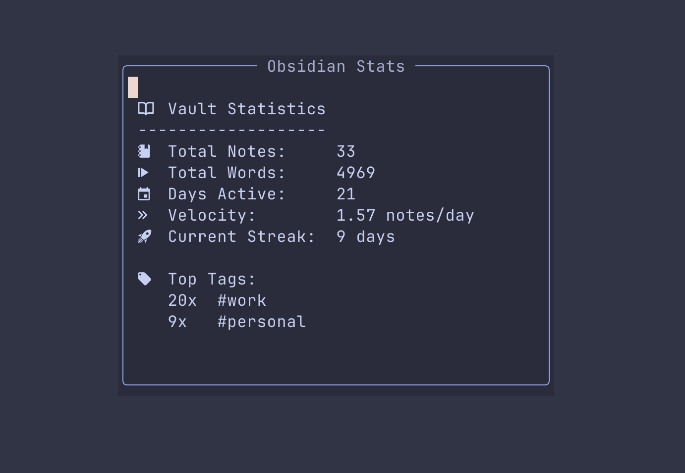

# obsidian-stats.nvim

A simple Neovim plugin to display statistics for your Obsidian vault.



## Features

- Total Notes count
- Total Word count
- Days Active (based on oldest file creation)
- Velocity (notes per day)
- Current Writing Streak
- Top 3 Tags

## Requirements

- Neovim >= 0.8.0
- macOS (uses BSD `stat` flags) - _Linux support requires adjustment to `stat` flags_
- [fd](https://github.com/sharkdp/fd)
- [ripgrep](https://github.com/BurntSushi/ripgrep) (rg)

## Installation

### lazy.nvim

```lua
{
  "damianpoole/obsidian-stats.nvim",
  cmd = "ObsidianStats",
  opts = {
    vault_path = "~/vaults/second-brain", -- Update this path
  },
}
```

## Usage

Run the command:

```vim
:ObsidianStats
```

## Configuration

Default configuration:

```lua
require("obsidian-stats").setup({
  vault_path = "~/vaults/second-brain",
})
```
